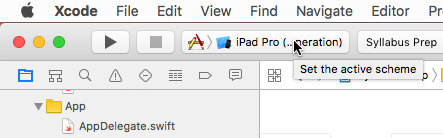
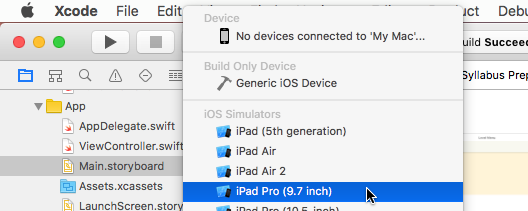
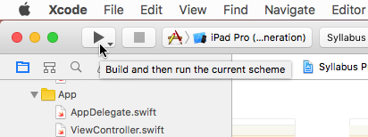

# Syllabus Prep

Syllabus Prep is way for students of the Oregon Music Teachers Association (OMTA) to study and prepare for their syllabus tests. Syllabus Prep will cover music theory for each syllabus level including ear training, rhythm training, and sight reading. This project is being developed in XCode in the Swift 3 language, and will eventually be released to the Apple Store.

The current state of this project is a work in progress. The list of stable builds are as follows:

- [**Ear Training - Stable**](https://github.com/mballeza/Syllabus-Prep/releases/tag/v0.1.2)

## Author

* **Matthew Balleza** 

- *Initial work* - [mballeza](https://github.com/mballeza)

- *Contact info* - matthewballeza@gmail.com, mballeza.vm@gmail.com

## License

This project is licensed under the Apache 2.0 License - see the [LICENSE](LICENSE) file for details.

This project includes third part open source software components: MIDISampler.swift. This file has been modified under permission of the MIT License. Please see [Third-Party-License/LICENSE-DeLisa](Third-Party-License/LICENSE-DeLisa)

## Definition of Terms

This project uses certain terms in its documentation and naming style. See the file [Terms.md](Terms.md) for more details.

## Prerequisites

**Xcode 8.0** or higher. This requires macOS. If you do not have macOS-compatible hardware, you can use a VM, such as [VirtualBox](https://www.virtualbox.org/wiki/Downloads). There are several online tutorials and resources to assist you.

**Swift 3** or higher.

**iOS 9.3** or higher for use on devices.

**An AppleID** to test and use on iOS devices.

## Build

### Simulator

1. Start Xcode, open Syllabus Prep.

2. Select and set the active scheme. Currently the UI is optimized for iPad devices. 





3. Build and run



### iOS Device

1. Plug in your iOS device to your computer. Note the UI is optimized for iPad devices.

2. Start Xcode, open Syllabus Prep.

3. Select and set the active scheme to your device.


4. Click the top-most level file in the project.


5. Under the "Signing" section, change the "Team" to your AppleID. Click on "Add an Account" to enter your ID and password.


6. Build and run


**Here are some useful keyboard shortcuts**

Clean

```
shift+cmd+k
```

Build

```
cmd+b
```

Run

```
cmd+r
```

Test

```
cmd+u
```

## Useful Links

- [AKMIDI](http://audiokit.io/docs/Classes/AKMIDI.html)

- [AudioKit](https://github.com/AudioKit/AudioKit)

- [Gene De Lisa's repositories on MIDI in the Swift language](https://github.com/genedelisa?utf8=%E2%9C%93&tab=repositories&q=MIDI&type=&language=swift)

